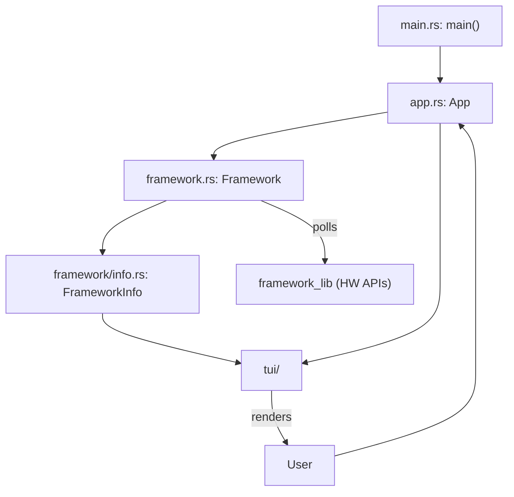
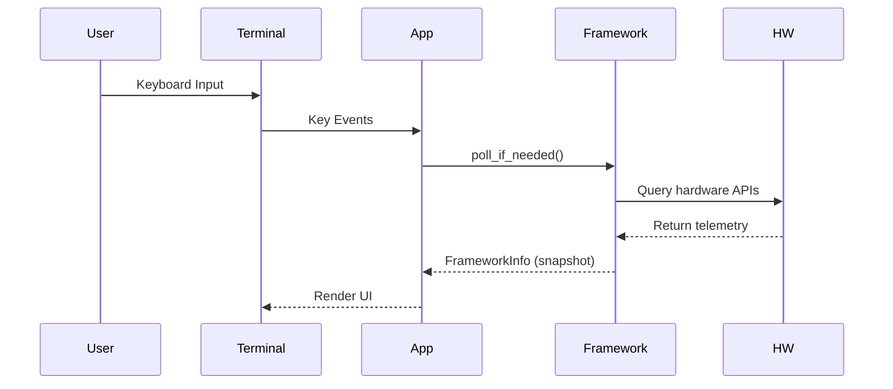

# Framework System TUI: Architecture

*Last updated: August 2025*

## Overview

Framework System TUI is a Rust-based dashboard that controls and monitors Framework laptop hardware from a terminal interface. It provides real-time data and interactive controls, organized into UI panels, using the [`ratatui`](https://github.com/ratatui-org/ratatui) library, and connects to hardware via the [`framework_lib`](https://github.com/FrameworkComputer/framework-lib) crate.

### Architectural Goals

- **Separation of Concerns:** UI logic (App) and hardware interface (Framework) are strictly isolated.
- **Periodic Polling:** Hardware status is updated at a fixed interval.
- **Panelized UI:** Each type of hardware info/control is presented in a dedicated TUI panel.
- **Error Handling:** Uses [`color-eyre`](https://docs.rs/color-eyre/) throughout for robust reporting.

## Module Overview

| Module                   | Path                        | Purpose                                            |
|--------------------------|-----------------------------|----------------------------------------------------|
| Main                     | [`src/main.rs`](src/main.rs:1)         | App entrypoint. Sets up TUI environment, runs App. |
| App                      | [`src/app.rs`](src/app.rs:1)           | Event/render loop. Owns Framework; handles UI, input. |
| Framework                | [`src/framework.rs`](src/framework.rs:1) | Manages hardware polling. Wraps EC and telemetry.  |
| FrameworkInfo            | [`src/framework/info.rs`](src/framework/info.rs:1) | Aggregates all hardware data for UI panels.         |
| Tui & Components         | [`src/tui/`](src/tui/)                  | Panels, layout, input handling in TUI.              |

## Data & Control Flow

### High-Level

1. **App Startup**: [`main.rs`](src/main.rs:1) sets up terminal and starts App.
2. **Event Loop**: [`App`](src/app.rs:14) periodically polls hardware via [`Framework`](src/framework.rs:12).
3. **Framework Polling**: [`Framework`](src/framework.rs:12) collects hardware info at interval, parses state to [`FrameworkInfo`](src/framework/info.rs:1).
4. **UI Panels**: [`App`](src/app.rs:14) renders state for distinct panels (battery, privacy, lighting, SMBIOS, PD ports etc).
5. **User Actions**: Keyboard input dispatched to [`App`](src/app.rs:61), which may trigger hardware mutations via [`Framework`](src/framework.rs:38-53).

### Component Diagram

### Event Sequence

### Periodic Polling

- Framework polls hardware at fixed `poll_interval`.
- Polling gathers:
  - Battery, charge %, power
  - Privacy status (cam/mic)
  - Brightness (keyboard, fingerprint)
  - SMBIOS info
  - PD ports
- State stored in FrameworkInfo then visualized by App.

## Component Details

### Main ([`src/main.rs`](src/main.rs:1))
- Entry point.
- Sets up color-eyre, initializes `ratatui`, runs `App::run()`.

### App ([`src/app.rs`](src/app.rs:14))
- Owns Framework and Tui.
- Handles event loop:
  - Polls Framework for updates.
  - Renders info in panels.
  - Handles keyboard input, dispatches actions (quit, set charge limit, adjust brightness).

### Framework ([`src/framework.rs`](src/framework.rs:12))
- Wraps underlying EC API (`CrosEc` from framework_lib).
- Exposes hardware mutation methods (set charge limit, set brightness).
- Polls all hardware data, collects into [`FrameworkInfo`](src/framework/info.rs:1).
- Decoupled from UI logic.

### FrameworkInfo ([`src/framework/info.rs`](src/framework/info.rs:1))
- Captures all hardware states as fields.
- Passed to TUI panels for display.

### TUI ([`src/tui/`](src/tui/))
- Panels implemented in submodules:
  - Battery, Charge, Privacy, SMBIOS, Brightness, PD Ports, Footer, Title
- Input routing, layout management, rendering via ratatui.

## Key Data Structures

- `App` (owns Framework, Info, TUI, controls lifecycle)
- `Framework` (owns hardware abstraction, polling logic)
- `FrameworkInfo` (complete telemetry snapshot for UI)
- `Tui` and panel objects

## Extensibility

- New hardware features added by extending `FrameworkInfo` and panel submodules.
- Platform independence maintained by isolating hardware logic in Framework.

## License

Licensed under the terms detailed in [`Cargo.toml`](Cargo.toml:1).
