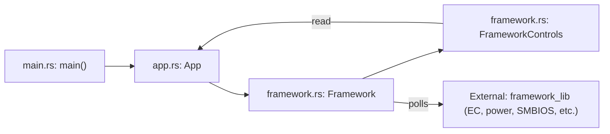
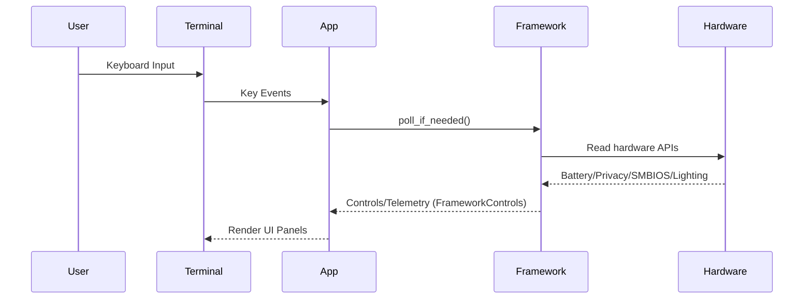
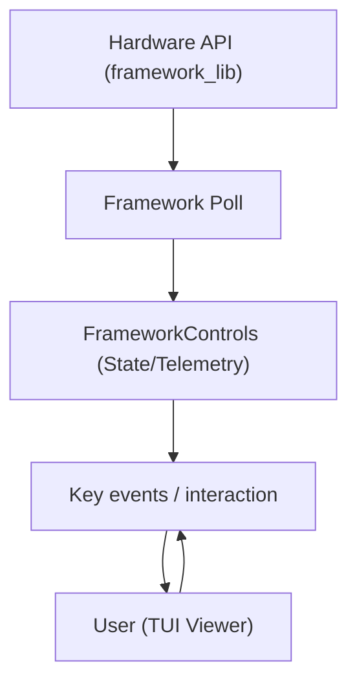

# Framework System TUI Architecture

This document explains the architecture and data flow for the Framework System TUI as of August 2025.

## Overview

The TUI dashboard manages hardware controls and state for Framework laptops. It uses Rust's `ratatui` library for UI, and interfaces with hardware through the `framework_lib` crate.

Core components:
- **App (src/app.rs)**: Handles the user interface and the main event/render loop.
- **Framework (src/framework.rs)**: Polls hardware, exposing controls and telemetry via `FrameworkControls`.
- **Main Entry (src/main.rs)**: Starts the app, sets up the TUI terminal environment.

## Component Diagram

## Sequence Diagram: Data and Event Flow

## Data Flow Diagram

## Component Descriptions

### App
- UI panels for battery, privacy, lighting, SMBIOS and more.
- Handles event loop: draws UI, reads keyboard actions, controls running state.
- Receives state from Framework (`self.framework.controls`).
- Forwards most hardware data queries to FrameworkControls.

### Framework
- Owns a `CrosEc` hardware control object.
- Periodically polls hardware (interval: `poll_interval`).
- Updates `FrameworkControls` struct, which extracts key data (battery stats, privacy, brightness, SMBIOS).
- Is isolated from TUI logic.

### FrameworkControls
- Holds the latest snapshot of all hardware data for UI rendering:
    - Battery: charge %, voltage, capacity, loss.
    - Privacy: mic/camera toggles.
    - Lighting: brightness levels.
    - SMBIOS: vendor, version, release date.

### Main
- Initializes terminal UI environment.
- Runs main loop (`App::run()`).
- Handles entering/exiting alternate screen and raw mode.

## Summary

The Framework System TUI is designed for clear separation between UI logic (App) and hardware access (Framework). Real-time data is regularly polled from hardware, then presented in multiple interactive panels.

License: See [Cargo.toml](Cargo.toml:1).